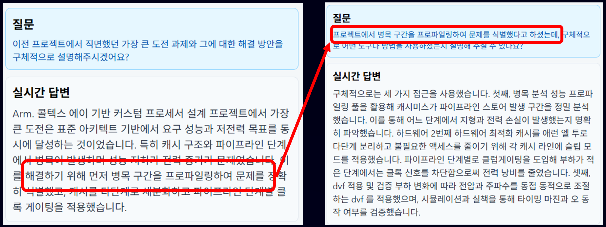

# ARES Backend - AI Interview Coach

## 📖 개요

ARES는 취업 준비생들이 면접 과정에서 겪는 어려움을 AI 기술로 해결하고자 탄생한 **AI 기반 모의 면접 및 역량 분석 플랫폼**의 백엔드 API 서버입니다.

### 해결하려는 문제

많은 취업 준비생들은 다음과 같은 문제에 직면합니다.

-   **부족한 실전 경험**: 실제와 같은 면접 환경에서 연습할 기회가 부족하여 실전 감각을 익히기 어렵습니다.
-   **막연한 피드백**: 스터디나 주변 지인을 통해 피드백을 받더라도, 전문적이고 객관적인 기준보다는 주관적인 감상에 그치는 경우가 많습니다.
-   **정보의 비대칭**: 지원하는 기업과 직무에 대한 깊이 있는 정보를 얻기 어려워, 동문서답을 하거나 피상적인 답변에 그치기 쉽습니다.

### ARES의 해결책

ARES는 최신 AI 기술을 활용하여 이러한 문제들을 해결하고, 사용자에게 **개인화된 맞춤형 면접 코칭 경험**을 제공합니다.

1.  **RAG 기반의 실시간 맞춤 질문**: `Azure OpenAI`와 `LlamaIndex`를 활용한 RAG(검색 증강 생성) 기술을 통해, 지원하는 **기업의 최신 사업보고서, 공시 자료** 등을 실시간으로 분석합니다. 이를 통해 생성된 질문들은 단순한 단답형 질문을 넘어, 지원자의 직무 이해도와 회사에 대한 관심을 심도 있게 파악할 수 있도록 설계되었습니다.
2.  **다각적인 심층 분석 리포트**: 모의 면접이 끝나면, 사용자의 답변 내용(텍스트)뿐만 아니라, 음성(말의 빠르기, 톤)과 영상(시선 처리, 표정)까지 분석하는 **다중 모드(Multi-modal) 분석**을 통해 종합적인 리포트를 제공합니다. 이를 통해 사용자는 자신의 강점과 약점을 객관적인 데이터로 확인하고 실질적인 개선점을 찾을 수 있습니다.
3.  **체계적인 커리어 관리**: 이력서와 경력, 학력 등 모든 커리어 정보를 한곳에서 관리하고, 이를 바탕으로 여러 버전의 이력서를 손쉽게 생성할 수 있는 기능을 제공하여 취업 준비 과정의 효율성을 극대화합니다.

ARES 백엔드는 이러한 핵심 기능들을 안정적으로 제공하기 위한 RESTful API 서버이며, 개발자, 투자자, 그리고 면접관에게 ARES 플랫폼의 기술적 깊이와 성장 가능성을 명확하게 보여주는 것을 목표로 합니다.

## 🚀 관련 프로젝트

-   **[ARES Frontend](https://github.com/project-ares-interview/ares-frontend)**: React Native와 Expo로 개발된 크로스플랫폼(iOS, Android, Web) 애플리케이션입니다. 본 백엔드 서버의 API를 사용하여 사용자에게 모든 기능을 직관적인 UI로 제공합니다.

## 🎬 시연 영상

[시연 영상](results/videos/jai_presentation.gif)

## 주요 기능

### 🤖 AI 기반 모의 면접

사용자가 실제 면접과 유사한 환경에서 AI 면접관과 상호작용하며 실전 감각을 익힐 수 있도록 설계되었습니다.

-   **주요 사용 라이브러리**: `LlamaIndex`, `Azure OpenAI`, `Azure AI Search`, `Azure Blob Storage`
-   **기능 상세**:
    1.  **면접 시작**: 사용자가 원하는 기업, 직무, 면접 난이도(보통, 어려움)를 선택하여 면접을 시작합니다 (`POST /api/v1/interviews/start/`).
    2.  **RAG 기반 질문 생성**: 백엔드는 `Azure Blob Storage`에 저장된 해당 기업의 최신 사업보고서, 공시 자료 등을 `LlamaIndex`를 통해 실시간으로 분석합니다. 이 정보를 바탕으로 `Azure OpenAI` LLM이 지원자의 이력서와 직무에 가장 적합한 첫 질문을 생성하여 반환합니다.
    3.  **꼬리 질문 및 답변**: 사용자가 답변을 제출하면(`POST /api/v1/interviews/answer/`), 시스템은 답변 내용을 분석하여 관련된 꼬리 질문을 생성합니다 (`POST /api/v1/interviews/next/`). 이 과정은 면접이 종료될 때까지 반복됩니다.
    
    4.  **구조화된 단계**: 면접은 `경험/역량` → `상황/케이스` → `조직 적합성`의 3단계로 체계적으로 진행되어, 지원자의 역량을 다각도로 검증합니다.
    5.  **가상 아바타 면접**: 
-   **결과**: 사용자는 실제 기업 및 직무와 높은 관련성을 가진 질문들을 통해 실질적인 면접을 경험할 수 있습니다. 모든 질문과 답변, 분석 내용은 세션별로 기록되어 면접 종료 후 리포트 생성에 사용됩니다.


### 📄 이력서 및 자소서 분석

사용자가 업로드한 이력서와 자기소개서 문서를 AI가 분석하여 강점과 약점을 진단하고, 예상 질문을 생성해주는 기능입니다.

-   **주요 사용 라이브러리**: `azure-ai-documentintelligence`, `pdfplumber`, `OpenAI`
-   **기능 상세**:
    1.  **문서 업로드 및 텍스트 추출**: 사용자가 PDF, DOCX 등의 이력서 파일을 업로드하면, `pdfplumber`나 `azure-ai-documentintelligence`를 사용하여 텍스트를 추출합니다.
    2.  **AI 분석 요청**: 추출된 텍스트를 `Azure OpenAI` 모델에 전달하여 분석을 요청합니다 (`POST /api/v1/resume/analyze/`).
    3.  **분석 및 결과 반환**: AI는 텍스트를 분석하여 다음과 같은 내용을 생성하여 반환합니다.
        -   **직무 역량 키워드**: 이력서 내용 기반의 핵심 역량 키워드 추출.
        -   **예상 면접 질문**: 경력, 프로젝트 경험을 바탕으로 한 예상 질문 목록.
        -   **답변 가이드라인**: 각 예상 질문에 대한 모범 답변 방향 제시.
        -   **개선 제안**: 이력서 내용의 강점과 약점을 분석하고, 보완할 점을 제안.
-   **결과**: 사용자는 자신의 이력서에 기반한 맞춤형 면접 질문을 미리 파악하고, 답변을 준비하며 면접 경쟁력을 높일 수 있습니다.


### 📊 심층 분석 리포트

모의 면접 종료 후, 사용자의 답변 내용과 음성, 영상(선택사항)을 종합적으로 분석하여 다각적인 피드백을 제공합니다.

-   **주요 사용 라이브러리**: `pandas`, `matplotlib`, `praat-parselmouth`, `librosa`, `opencv-python`, `mediapipe`
-   **기능 상세**:
    1.  **리포트 생성**: 면접 세션이 종료되면(`POST /api/v1/interviews/finish/`), 해당 세션(`session_id`)의 모든 데이터를 바탕으로 분석 리포트가 생성됩니다.
    2.  **텍스트 분석**: 사용자의 모든 답변을 `Azure OpenAI`를 통해 분석하여 내용의 논리성, 직무 관련성, 문제 해결 능력 등을 평가합니다.
    3.  **음성 분석**: `librosa`, `parselmouth`를 사용하여 답변 음성의 빠르기, 톤의 변화, 목소리 크기 등을 분석하여 발표 습관에 대한 피드백을 제공합니다.
    4.  **영상 분석**: `opencv-python`, `mediapipe`를 사용하여 시선 처리, 표정 변화, 자세 등을 분석하여 비언어적 커뮤니케이션 요소를 평가합니다.
    5.  **종합 평가**: NCS 직무 역량 분류 기준에 따라 역량을 평가하고, 전체 지원자 중 백분위 순위를 계산합니다. `matplotlib`을 사용하여 레이더 차트 등 시각 자료를 생성합니다.
-   **결과**: 사용자는 자신의 강점과 약점을 객관적인 데이터로 확인하고, 개선 방향에 대한 구체적인 AI 조언이 담긴 종합 리포트를 받게 됩니다 (`GET /api/v1/interviews/report/<uuid:session_id>/`).


### 👤 사용자 프로필 및 이력서 관리

사용자의 기본 정보와 경력, 학력 등 커리어 정보를 체계적으로 관리할 수 있는 API를 제공합니다.

-   **주요 사용 라이브러리**: `Django REST Framework`, `django-ordered-model`
-   **기능 상세**:
    -   **프로필 관리**: 사용자의 학력, 경력, 자격증, 수상 내역, 외국어 능력 등 프로필 정보를 항목별로 생성(Create), 조회(Read), 수정(Update), 삭제(Delete)하는 API를 제공합니다.
    -   **이력서 관리**: 여러 버전의 이력서를 생성하고 관리할 수 있습니다. 새로운 이력서 생성 시, 기존 프로필 정보를 자동으로 불러와 채워주는 기능을 제공하여 사용자 편의성을 높였습니다.
    -   **순서 관리**: `django-ordered-model`을 도입하여 학력, 경력 등 목록의 순서를 사용자가 원하는 대로 손쉽게 변경하고 유지할 수 있도록 했습니다. API 요청만으로 순서가 자동으로 재정렬되어, 프론트엔드에서의 복잡한 순서 관리 로직을 최소화합니다.
-   **결과**: 사용자는 자신의 모든 커리어 정보를 한 곳에서 관리하고, 이를 바탕으로 손쉽게 여러 버전의 이력서를 작성할 수 있습니다.

### 📅 구글 캘린더 연동

사용자가 자신의 구글 캘린더와 ARES 서비스를 연동하여 면접 일정을 자동으로 기록하고 관리할 수 있도록 돕습니다.

-   **주요 사용 라이브러리**: `google-api-python-client`, `google-auth-oauthlib`
-   **기능 상세**:
    1.  **OAuth 2.0 인증**: `google-auth-oauthlib`을 사용하여 안전한 OAuth 2.0 인증 과정을 통해 사용자로부터 구글 캘린더 접근 권한을 위임받습니다 (`GET /api/v1/calendar/google-auth-url/`).
    2.  **이벤트 추가/조회/삭제**: 인증이 완료되면, `google-api-python-client`를 사용하여 사용자의 구글 캘린더에 면접 일정을 추가(`POST /api/v1/calendar/add-event/`), 조회(`GET /api/v1/calendar/events/`), 삭제(`DELETE /api/v1/calendar/delete-event/<id>/`)할 수 있습니다.
-   **결과**: ARES 플랫폼 내에서 잡힌 모의 면접 일정이나, 사용자가 직접 등록한 실제 면접 일정이 사용자의 구글 캘린더에 자동으로 동기화되어 편리하게 일정을 관리할 수 있습니다.


## 아키텍처

ARES 백엔드는 확장성과 유지보수성을 고려하여 다음과 같은 아키텍처로 설계되었습니다.

-   **기반 프레임워크 (Django & DRF)**: 안정성과 빠른 개발 속도를 위해 Django와 Django REST Framework(DRF)를 채택했습니다. Django의 ORM, 관리자 페이지 등 내장 기능을 적극 활용하고, DRF를 통해 RESTful API를 효율적으로 구축합니다.

-   **API 구조 (ViewSets & Serializers)**: DRF의 `ViewSet`과 `Serializer`를 기반으로 API를 구현합니다. `ModelViewSet`을 사용하여 기본적인 CRUD API를 빠르게 개발하고, 복잡한 비즈니스 로직은 각 `ViewSet`의 메서드(ex: `perform_create`)에 구현하여 역할을 분리합니다. `Serializer`는 데이터의 유효성 검사 및 직렬화/역직렬화를 담당합니다.

-   **인증 (dj-rest-auth & Simple JWT)**: `dj-rest-auth`와 `djangorestframework-simplejwt`를 조합하여 JWT 기반의 인증 시스템을 구현했습니다. 프론트엔드는 `Access Token`과 `Refresh Token`을 발급받아 API 요청 시 사용하며, 서버는 `JWTCookieAuthentication`을 통해 쿠키에 담긴 토큰을 안전하게 검증합니다.

-   **RAG 파이프라인**: AI 면접 질문 생성의 핵심 로직으로, `LlamaIndex`를 사용하여 구축되었습니다. 이 파이프라인은 다음과 같이 동작합니다.
    1.  **문서 로드**: `Azure Blob Storage`에 저장된 기업 자료(PDF, TXT 등)를 로드합니다.
    2.  **인덱싱**: 로드된 문서를 `Azure OpenAI`의 임베딩 모델(`text-embedding-3-small`)을 사용하여 벡터로 변환하고, `Azure AI Search`에 인덱싱하여 벡터 저장소를 구축합니다.
    3.  **검색 및 생성**: 사용자 질문이 들어오면, 해당 질문과 가장 관련성 높은 문서를 벡터 저장소에서 검색(Retrieval)하고, 검색된 문서와 원본 질문을 `Azure OpenAI`의 LLM(`gpt-4o`)에 함께 전달하여 최종 답변(꼬리 질문)을 생성(Generation)합니다.


## 프로젝트 구조

```
/ares-backend
├── ares/                 # Django 프로젝트 루트
│   ├── api/              # 핵심 API 로직을 담고 있는 Django 앱
│   │   ├── models/       # 데이터베이스 모델 (User, Resume, Interview 등)
│   │   ├── serializers/  # 데이터 직렬화 및 유효성 검사
│   │   ├── views/        # API 엔드포인트 로직 (DRF ViewSets)
│   │   ├── urls.py       # API 라우팅 설정
│   │   └── ...
│   ├── settings.py       # Django 프로젝트 설정
│   └── urls.py           # 최상위 URL 라우팅
├── data/                 # AI 모델 학습/분석에 사용되는 초기 데이터
├── logs/                 # 애플리케이션 로그
├── manage.py             # Django 관리 스크립트
├── pyproject.toml        # 프로젝트 의존성 및 설정 (uv)
└── requirements.txt      # pyproject.toml과 동기화되는 의존성 목록
```

## 기술 스택

- **Backend**: Django, Django REST Framework
- **AI/ML**:
  - **RAG Pipeline**: LlamaIndex
  - **LLM**: Azure OpenAI, OpenAI
  - **Vector Store**: Azure AI Search
  - **Document Storage**: Azure Blob Storage
  - **Speech and Audio**: `azure-cognitiveservices-speech`, `librosa`, `praat-parselmouth`
  - **Computer Vision**: `opencv-python`, `mediapipe`
  - **Data Handling**: `pandas`, `numpy`
- **Authentication**: `dj-rest-auth`, `djangorestframework-simplejwt`, `django-allauth`
- **Database**: SQLite (기본값), 다른 데이터베이스로 설정 가능
- **API Documentation**: `drf-spectacular`
- **Async/WebSockets**: `channels`, `daphne`
- **Package Management**: uv
- **Environment Management**: python-dotenv

## 설치 및 실행 방법

### 1. 사전 요구사항

- Python 3.11.9 이상
- `uv` 패키지 관리자
- Azure 계정 및 아래 서비스 생성:
  - Azure Storage Account (Blob 컨테이너 생성)
  - Azure AI Search
  - Azure OpenAI Service (모델 배포)

### 2. 프로젝트 클론

```bash
git clone https://github.com/project-ares-interview/ares-backend.git
cd ares-backend
```

### 3. 가상 환경 생성 및 라이브러리 설치

`uv`를 사용하여 가상 환경을 생성하고, `pyproject.toml`에 명시된 라이브러리를 설치합니다.

```bash
# 가상 환경 생성
uv venv

# 가상 환경 활성화
source .venv/bin/activate  # macOS/Linux
.venv\Scripts\activate    # Windows

# 라이브러리 동기화
uv pip sync pyproject.toml
```

### 4. 환경 변수 설정

프로젝트 루트에 `.env.development` 파일을 생성하고 아래 내용을 채워넣습니다.

```env
# Django Settings
SECRET_KEY='your-django-secret-key'
DEBUG=True

# Database (SQLite example)
# DATABASE_URL=sqlite:///db.sqlite3

# Azure Services
AZURE_STORAGE_CONNECTION_STRING='your-storage-connection-string'
AZURE_SEARCH_ENDPOINT='https://your-search-service.search.windows.net'
AZURE_SEARCH_KEY='your-search-admin-key'
AZURE_OPENAI_ENDPOINT='https://your-openai-service.openai.azure.com/'
AZURE_OPENAI_KEY='your-openai-api-key'
AZURE_OPENAI_API_VERSION='2024-02-15-preview' # 사용하는 API 버전에 맞게 수정
AZURE_OPENAI_MODEL='your-deployment-name' # gpt-4o 등
AZURE_OPENAI_EMBEDDING_MODEL='your-embedding-deployment-name' # text-embedding-3-small 등

# Social Auth (Optional)
GOOGLE_CLIENT_ID='your-google-client-id'
GOOGLE_CLIENT_SECRET='your-google-client-secret'
```

### 5. 데이터베이스 마이그레이션

```bash
uv run python manage.py migrate
```

### 6. 개발 서버 실행

`uv`를 사용하여 개발 서버를 실행합니다.

```bash
uv run daphne -p 8000 ares.asgi:application
```

## 주요 API 엔드포인트

- **`POST /api/v1/interviews/start/`**: 새로운 AI 모의 면접을 시작합니다.
- **`POST /api/v1/interviews/next/`**: 다음 꼬리 질문을 요청합니다.
- **`POST /api/v1/interviews/answer/`**: 질문에 대한 답변을 제출하고 분석을 요청합니다.
- **`POST /api/v1/interviews/finish/`**: 면접을 종료합니다.
- **`GET /api/v1/interviews/report/<uuid:session_id>/`**: 특정 면접 세션의 최종 리포트를 조회합니다.
- **`POST /api/v1/resume/analyze/`**: 이력서 텍스트를 분석합니다.
- **`POST /api/v1/auth/registration/`**: 회원가입
- **`POST /api/v1/auth/login/`**: 로그인

> 이 외에도 이력서, 자기소개서, 사용자 프로필 관리를 위한 다양한 CRUD 엔드포인트가 `ares/api/views/v1/urls.py`에 정의되어 있습니다.
>
> 전체 API 문서는 서버 실행 후 `/api/schema/swagger-ui/` 또는 `/api/schema/redoc/`에서 확인하실 수 있습니다.

## Team

| <a href="https://github.com/Windy-kim12"></a> | <a href="https://github.com/howl-papa"></a> | <a href="https://github.com/Jang-Eunho"></a> | <a href="https://github.com/J1STAR"></a> | <a href="https://github.com/soheejin"></a> | <a href="https://github.com/DongDong2e2e"></a> |
| :----------------------------------------------------------------------------------------------------: | :------------------------------------------------------------------------------------------------: | :--------------------------------------------------------------------------------------------------: | :----------------------------------------------------------------------------------------------: | :------------------------------------------------------------------------------------------------: | :------------------------------------------------------------------------------------------------------: |
|                               [김서현](https://github.com/Windy-kim12)                               |                               [박용락](https://github.com/howl-papa)                               |                               [장은호](https://github.com/Jang-Eunho)                               |                                [장한별](https://github.com/J1STAR)                                 |                                [진소희](https://github.com/soheejin)                                 |                              [최동휘](https://github.com/DongDong2e2e)                               |